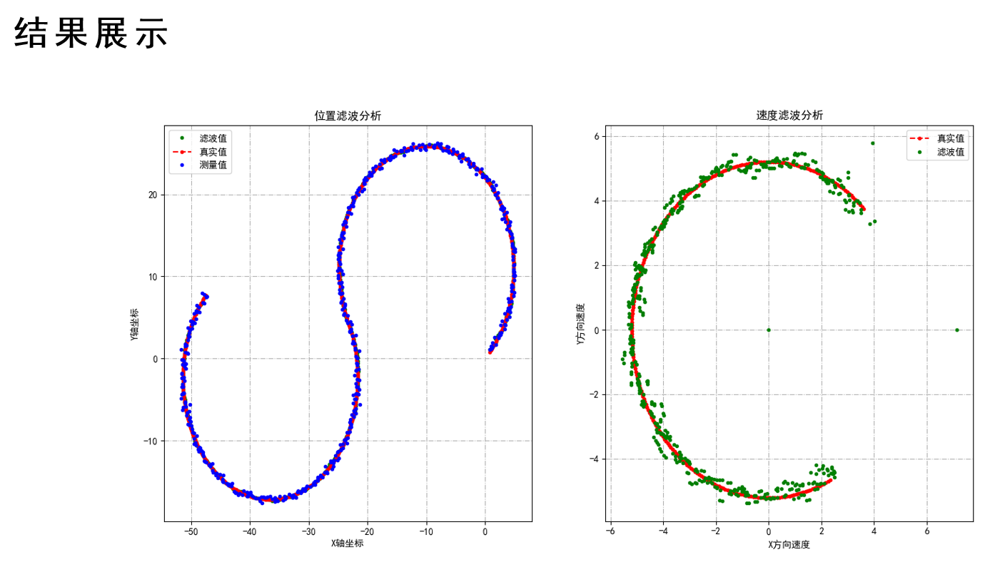

# Python-CTRV-simulation
Simulation of Maneuvering Target Tracking Based on Kalman Filter. My Bachelor’s Thesis.

# Abstract
In this paper, a constant velocity model (CV), a constant acceleration model (CA) and a
constant turn rate and velocity model (CTRV) are established by using discrete linear Kalman
filter for maneuvering target tracking. The linear CA model and nonlinear CTRV model are
simulated by Python language, and the results show that the proposed method can achieve the
data fusion and accurate tracking effect of maneuvering target.

# 摘要
本文针对机动目标跟踪问题采用离散线性卡尔曼滤波建立了恒定速度模型(CV)、恒定加速度模型(CA)和恒定转弯率和速度模型(CTRV)。对线性的 CA 模型和非线性 CTRV 模型，采用 Python 语言进行了实例仿真，结果表明本文方法能较好达到机动目标的数据融合和精确跟踪的效果。

# Note
The paper and PPT are in the `docu` folder.

论文和ppt在`docu`文件夹下

# Issues
The shape of the state space (JA) should be [5X5], numdifftools calculates the shape as [1X5X5].You can use numdifftools==0.6.0, but then you will get a warning about numerical calculations, you can also handle the dimensions yourself.

# result

